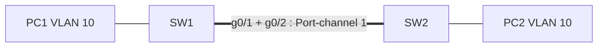

# Lab Cisco : EtherChannel avec LACP

> **Statut : à réaliser.** Ce guide est préparé à partir de la documentation officielle et de mes cours ; **je ne l'ai pas encore rejoué de bout en bout**. Les commandes sont à valider en le faisant, et le journal en bas de page sera complété avec mes résultats réels (captures, erreurs rencontrées, corrections).

## Objectif

Regrouper **plusieurs liens physiques entre deux switchs en un seul lien logique** (EtherChannel) avec le protocole standard **LACP** : plus de bande passante, et la panne d'un câble ne coupe plus la liaison. Comprendre pourquoi Spanning Tree ne bloque pas ces liens.

## Prérequis

- Cisco Packet Tracer (deux switchs 2960 ou 3560).
- Avoir vu les VLAN et les trunks (voir [labs-reseau-cisco](https://github.com/mehdiseg/labs-reseau-cisco)).

## Topologie



| Poste | Adresse | VLAN |
|---|---|---|
| PC1 | 192.168.10.11/24 | 10 |
| PC2 | 192.168.10.12/24 | 10 |

Sans EtherChannel, deux câbles entre deux switchs créent une **boucle** : Spanning Tree en bloque un et la bande passante reste celle d'un seul lien.

## Étapes

### 1. Créer le groupe sur SW1 (et de même sur SW2)

Fichier du dépôt : [`configs/SW1.txt`](configs/SW1.txt)

```text
enable
configure terminal
hostname SW1
vlan 10
 name POSTES
interface range g0/1-2
 shutdown
 channel-group 1 mode active
 no shutdown
interface port-channel 1
 switchport mode trunk
 switchport trunk allowed vlan 10
interface f0/1
 switchport mode access
 switchport access vlan 10
end
write memory
```

`mode active` = LACP négocie activement. Combinaisons valables : `active`-`active` ou `active`-`passive`. `passive`-`passive` ne forme jamais de lien (personne ne prend l'initiative). Mettre les interfaces en `shutdown` avant de les regrouper évite que Spanning Tree bloque un lien pendant la configuration.

La configuration du port-channel (trunk, VLAN autorisés) se fait sur **l'interface `port-channel`** : elle s'applique aux liens membres.

### 2. Configuration identique sur SW2

Reprendre la même configuration avec `hostname SW2` (le port d'accès `f0/1` relie PC2). Les membres doivent avoir **les mêmes paramètres** des deux côtés : vitesse, duplex, mode (trunk/accès), VLAN autorisés.

> Si la version de Packet Tracer utilisée ne propose pas LACP, utiliser `channel-group 1 mode desirable` (protocole propriétaire Cisco PAgP) et le noter dans le journal.

## Vérifications

```text
show etherchannel summary   ! Po1(SU) : S = niveau 2, U = en service ; membres Gi0/1(P) Gi0/2(P), P = dans le canal
show interfaces trunk       ! le trunk est sur Port-channel 1, pas sur les deux ports physiques
show spanning-tree vlan 10  ! le port-channel est vu comme un seul lien
ping 192.168.10.12          ! depuis PC1 vers PC2
```

**Test de panne** : lancer un ping continu entre PC1 et PC2, puis `shutdown` sur `g0/1` de SW1. Le ping doit continuer (avec, au plus, une perte de quelques paquets). Réactiver le lien et vérifier `show etherchannel summary`.

## Pièges fréquents

- Membres avec des réglages différents : le port reste `(s)` (suspendu) ou `(I)` (indépendant).
- `passive` des deux côtés : aucun canal.
- Mélange de protocoles : `active` d'un côté, `desirable` (PAgP) de l'autre.
- Configuration du trunk faite sur les interfaces physiques au lieu de `interface port-channel`.

## Pour aller plus loin

- Observer la **répartition de charge** (`port-channel load-balance src-dst-ip`) : elle se fait par flux, pas par paquet.
- Ajouter un troisième switch et observer Spanning Tree (rapid-PVST) avec deux EtherChannels.
- Ajouter la commande `spanning-tree portfast` sur les ports d'accès et `bpduguard` pour les protéger.

## Journal de réalisation

_Lab pas encore réalisé : cette section sera remplie au fur et à mesure._

| Date | Ce que j'ai fait | Résultat | Difficultés et solutions |
|---|---|---|---|
|  |  |  |  |

## Feuille de route

Ce lab fait partie de ma [feuille de route réseau](https://github.com/mehdiseg/roadmap-reseau-bts-sio).

## Licence

[MIT](LICENSE)
